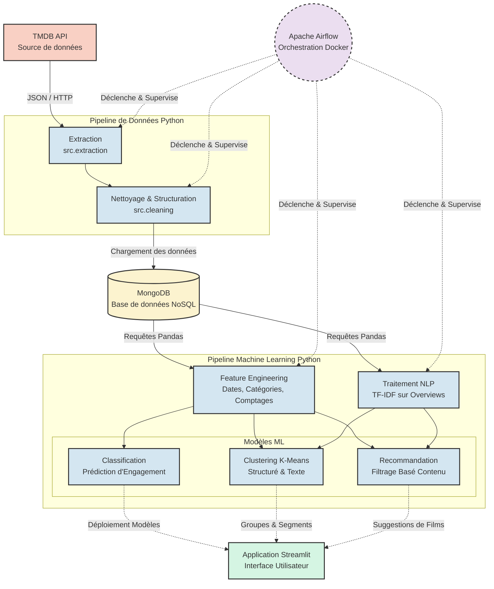

# Architecture du Projet TMDB Analytics Pipeline

Voici le diagramme d'architecture au format Mermaid illustrant l'organisation générale du projet, le flux de données, le pipeline Machine Learning et l'interaction entre les différents composants (Airflow, MongoDB, Python, Streamlit).

